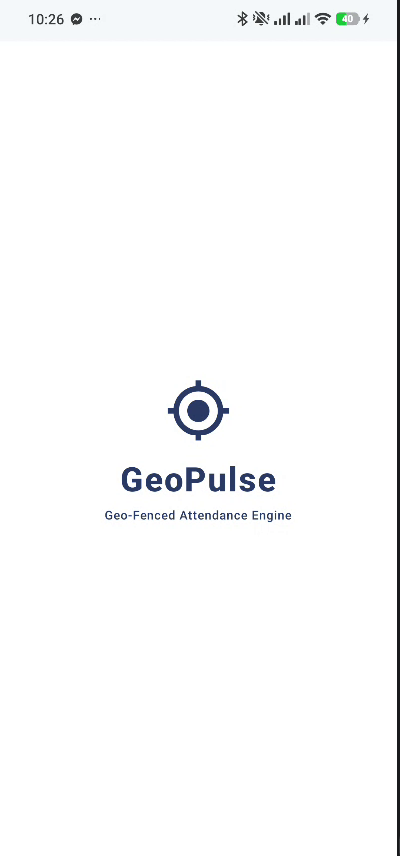
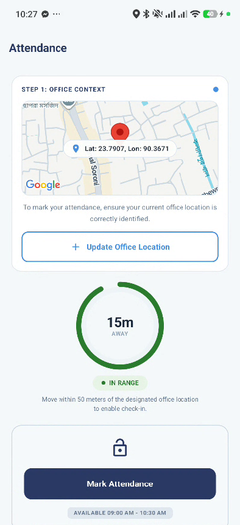

# GeoPulse - Geo-Fenced Workforce Attendance System

A modern, location-aware workforce attendance mobile application built with Native Android (Kotlin, Jetpack Compose, Room Database, and Google FusedLocationProviderClient) delivering high-accuracy geofence validation, interactive Google Maps integration, and real-time distance tracking.

---

## 1. Project Title and Description

**Project Title:** `GeoPulse` — Smart Geo-Fenced Workforce Attendance Engine  
**Task 1 Scope:** Native Android Attendance Module  

### Description:
GeoPulse is an enterprise-level Android application that enables employees to register their designated office location and validate their attendance based on precise GPS coordinates. The application features a 50-meter geofence perimeter enforcement where the "Mark Attendance" action remains locked until the user enters the designated radius. It includes an animated splash screen, an interactive Google Map displaying the office marker pin, real-time distance indicator gauge, range status badge, and persistent local attendance logging via Room Database.

---

## 2. Project Structure / Approaches

### Architectural Approach:
GeoPulse is built using **Layered Clean Architecture** and **MVVM with Unidirectional Data Flow (UDF)** to maintain clear separation of concerns across `presentation`, `domain`, and `data` layers.

> **Architecture & Key Classes:**  
> The core state management relies on `AttendanceViewModel` observing reactive Kotlin `StateFlow` updates from `ObserveCurrentLocationUseCase` and `GetOfficeLocationUseCase`, rendering an immutable `AttendanceUiState` in Jetpack Compose while storing location coordinates and check-in history in `GeoPulseDatabase` via Room DAOs.

### Directory Overview:
```
GeoPulse/
├── app/src/main/java/com/geopulse/attendance/
│   ├── domain/                         # Business Logic & Abstractions
│   │   ├── model/                      # Domain models (LocationCoordinates, GeofenceStatus, AttendanceRecord)
│   │   ├── repository/                 # Repository Interfaces (LocationRepository, AttendanceRepository)
│   │   └── usecase/                    # Use Cases (SetOfficeLocationUseCase, MarkAttendanceUseCase, etc.)
│   ├── data/                           # Data Sources & Persistence
│   │   ├── local/                      # Room DB (GeoPulseDatabase, OfficeLocationEntity, AttendanceEntity)
│   │   ├── location/                   # LocationClientImpl with FusedLocationProviderClient & callbackFlow
│   │   └── repository/                 # Repository Implementations
│   ├── di/                             # Dagger Hilt Dependency Injection Modules
│   └── ui/                             # Presentation Layer (Jetpack Compose)
│       ├── splash/                     # SplashScreen composable
│       ├── attendance/                 # AttendanceScreen, AttendanceViewModel, Components
│       └── theme/                      # App Colors, Typography, Themes
```

---

## 3. Generative AI Usage

Generative AI (Google Antigravity AI assistant) was used as a pair-programming partner during development to refine reactive location streaming with Kotlin Flow, design custom Jetpack Compose canvas components.

### Essential Prompts Used:
1. **Reactive Location Provider:**
   > *"Write a LocationClient implementation using Google FusedLocationProviderClient wrapped in Kotlin callbackFlow to stream location updates reactively."*

2. **Custom Compose UI Gauge:**
   > *"Create a Jetpack Compose circular gauge drawing an arc indicator with text overlay displaying distance in meters and range badge pill."*


### Developer Reflections & Methodology:
Using AI assistance helped adhere strictly to modern Android engineering practices:
- **Reactive Stream Handling:** Leveraged `callbackFlow` to convert Google Play Services location callbacks into Coroutine streams that automatically clean up when scope ends.
- **Unidirectional Data Flow (UDF):** Enforced single source of truth in `AttendanceViewModel` using Kotlin `StateFlow` and immutable UI state.
- **Empirical Build Verification:** Utilized Android SDK CLI tooling (`gradlew assembleDebug`, `gradlew test`) for build and test validation.

---

## 4. How to Run

### Prerequisites:
- **Android Studio:** Jellyfish (2023.3.1) or newer
- **JDK:** Java 17+
- **Android SDK:** API Level 34 (Android 14)

### Steps to Run:
1. **Clone the Repository:**
   ```bash
   git clone https://github.com/<your-username>/GeoPulse.git
   cd GeoPulse
   ```

2. **Configure SDK Location & Google Maps API Key:**
   Create or open `local.properties` in the project root directory and add your Android SDK path and your Google Maps API Key:
   ```properties
   sdk.dir=C\:\\Users\\USER\\AppData\\Local\\Android\\Sdk
   MAPS_API_KEY=YOUR_GOOGLE_MAPS_API_KEY_HERE
   ```
   > 🔑 **API Key Security:** `local.properties` is explicitly ignored by `.gitignore` so your private Google Maps API key will never be committed to Git. Gradle automatically injects `MAPS_API_KEY` into `AndroidManifest.xml` at build time.

3. **Build Debug APK:**
   ```bash
   ./gradlew assembleDebug
   ```
   *The generated APK will be available at:* `app/build/outputs/apk/debug/app-debug.apk`

4. **Run Unit Tests:**
   ```bash
   ./gradlew test
   ```

5. **Deploy to Device / Emulator:**
   Connect a physical Android device or start an AVD with Location enabled, then execute:
   ```bash
   ./gradlew installDebug
   ```

---

## 5. Screenshots

| Splash Screen | Attendance Screen (In Range) |
| :---: | :---: |
|  |  |
"# GeoPulse" 
